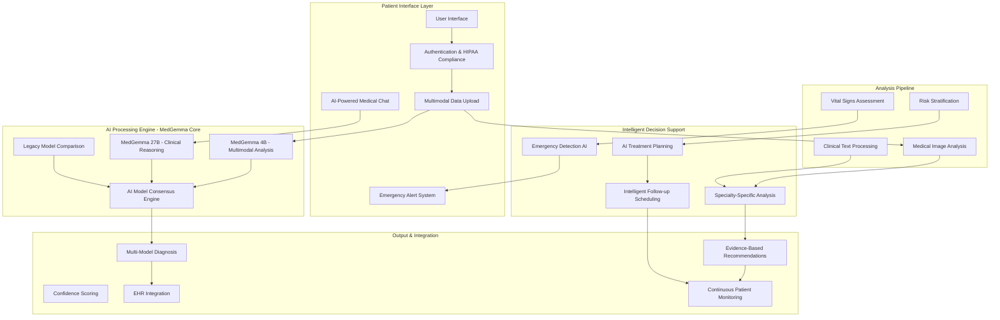
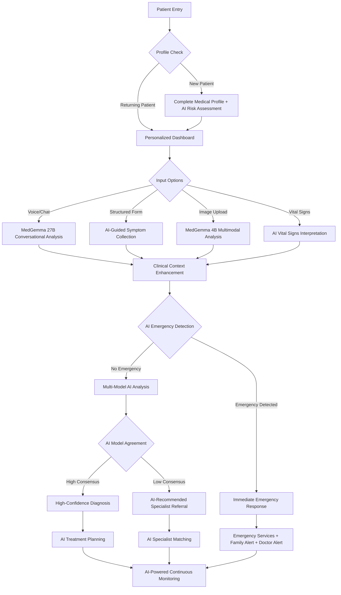
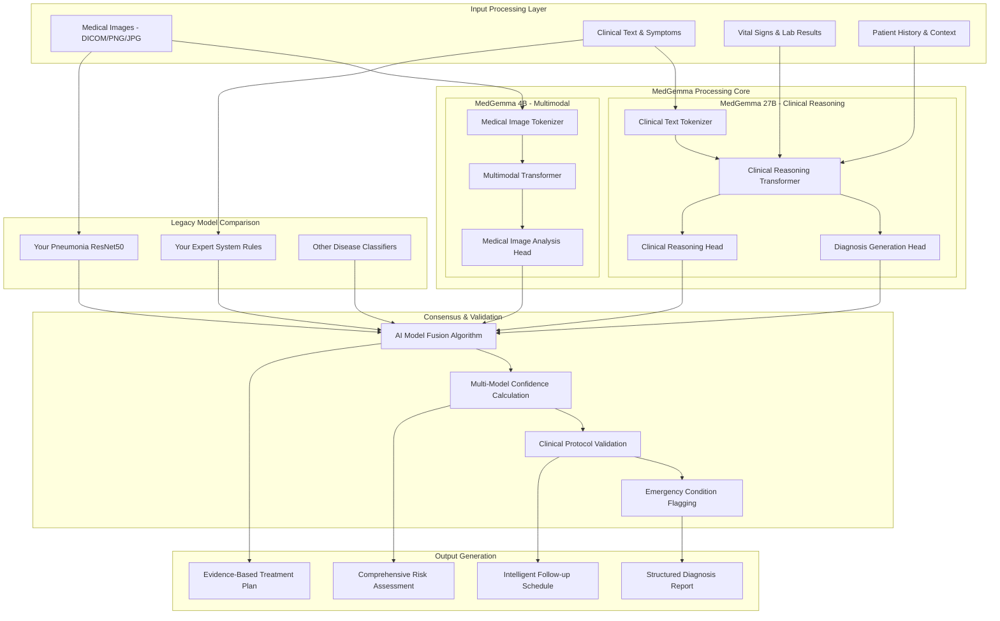
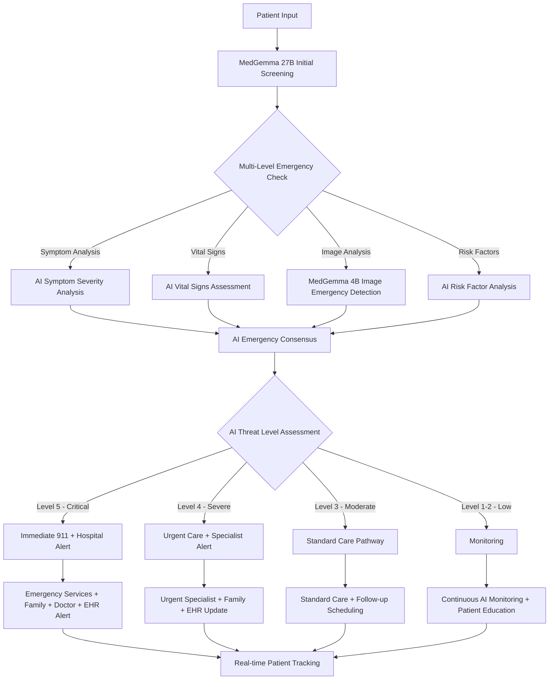
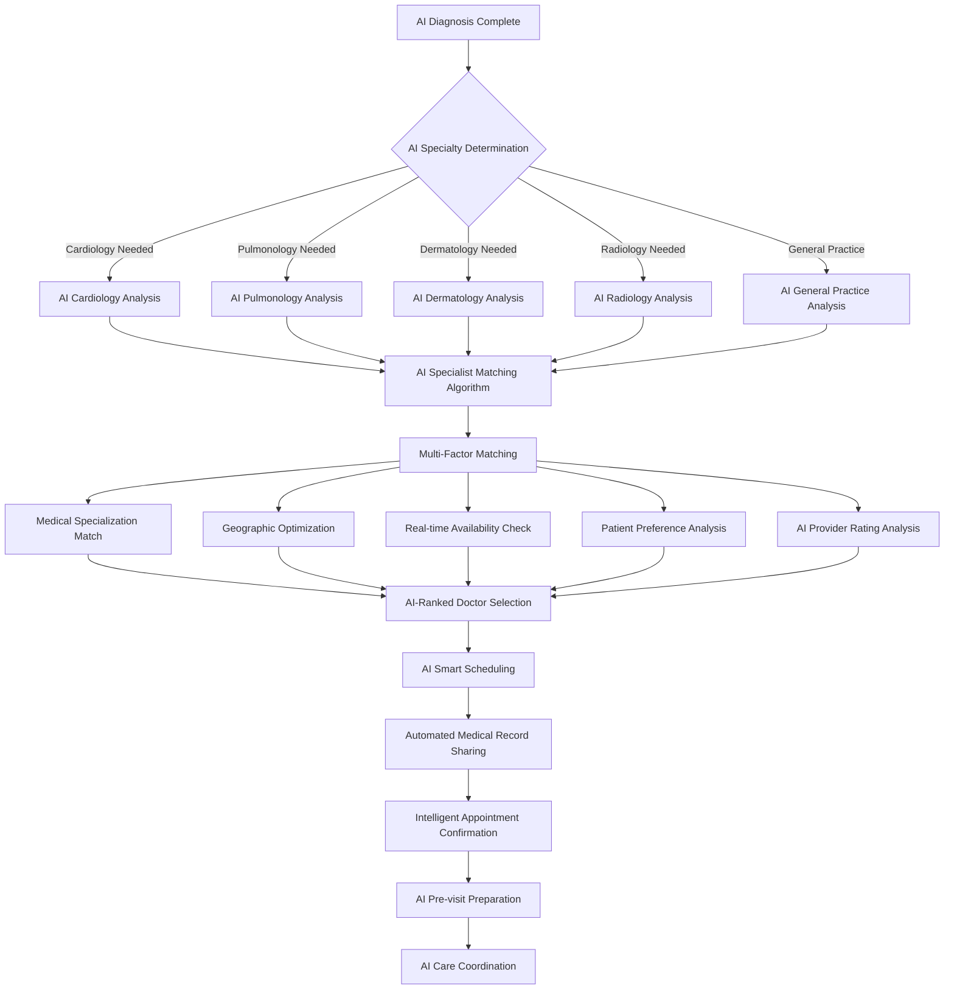
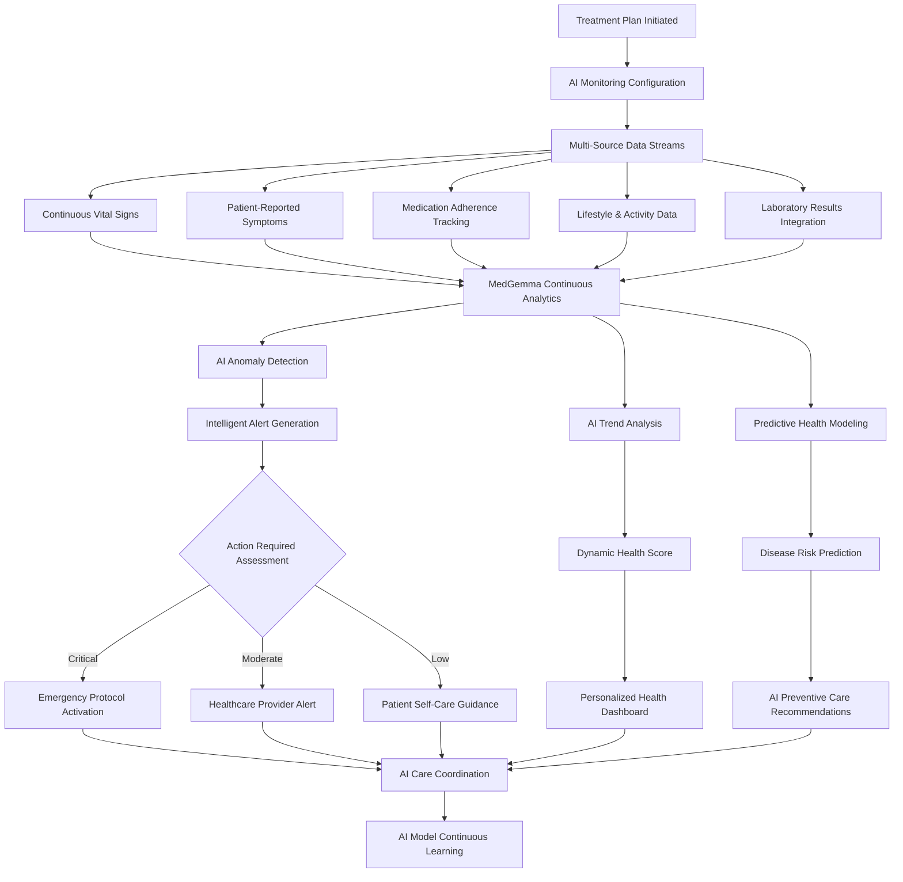
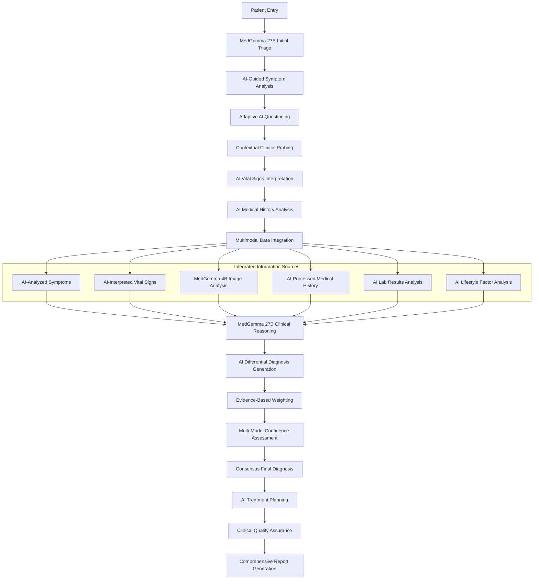
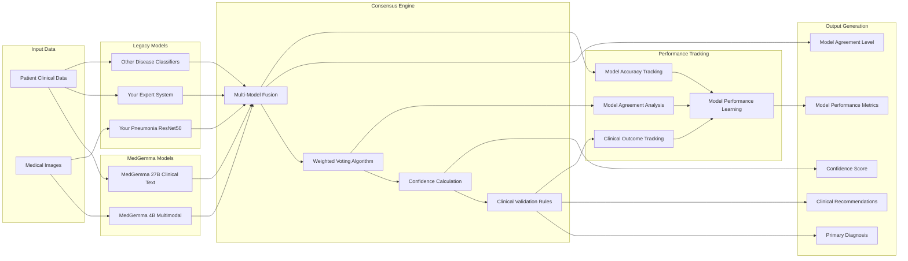

# MedFlow System Architecture Diagrams with MedGemma

```
    Final Predicted
```

## 1. High-Level System Architecture



## 2. Patient Journey Flow with AI Decision Points



## 3. MedGemma AI Processing Pipeline



## 4. Emergency Response Flow



## 5. AI-Doctor Referral & Matching System



## 6. Health Monitoring & Predictive Analytics



## 7. Information Gathering & Clinical Reasoning Flow



## 8. Model Comparison & Validation Architecture



## Key Enhancements in the New System Flow:

### 🧠 **AI-First Architecture**
- **MedGemma 4B** handles all multimodal medical image analysis
- **MedGemma 27B** provides advanced clinical reasoning and text analysis
- **AI Consensus Engine** combines multiple AI models for better accuracy

### 🚨 **Multi-Level Emergency Detection**
- **Real-time AI screening** of all patient inputs
- **5-level emergency classification** system
- **Automated emergency response** protocols

### 🔍 **Clinical Reasoning**
- **Adaptive questioning** based on AI analysis
- **Evidence-based differential diagnosis**
- **Continuous learning** from clinical outcomes

### 🤝 **Intelligent Care Coordination**
- **AI-powered specialist matching**
- **Automated medical record sharing**
- **Predictive health monitoring**

### 📊 **Model Performance Optimization**
- **Continuous comparison** between MedGemma and legacy models
- **Real-time performance tracking**
- **Adaptive model weighting** based on accuracy

### 🔒 **Security & Compliance**
- **HIPAA-compliant data handling**
- **Audit logging** for all AI decisions
- **Patient privacy protection** throughout the pipeline

This architecture maintains your existing strengths while adding cutting-edge AI capabilities, ensuring better patient outcomes and more efficient healthcare delivery.