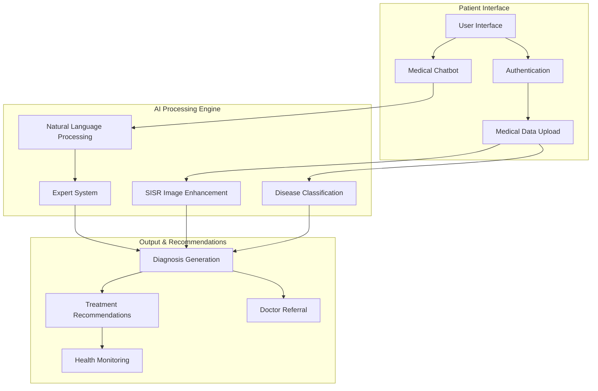
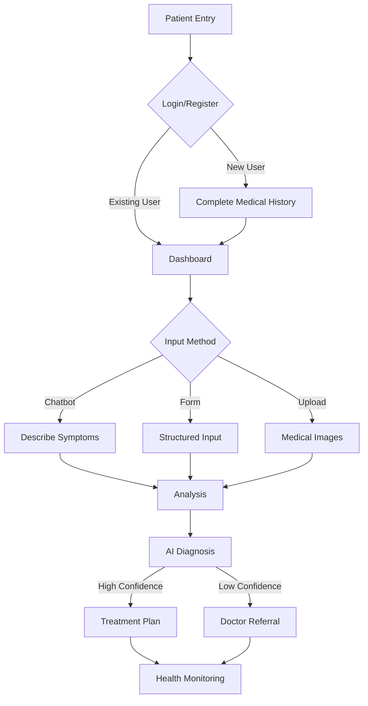
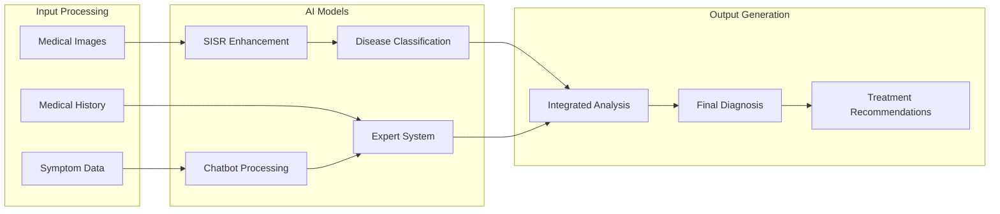
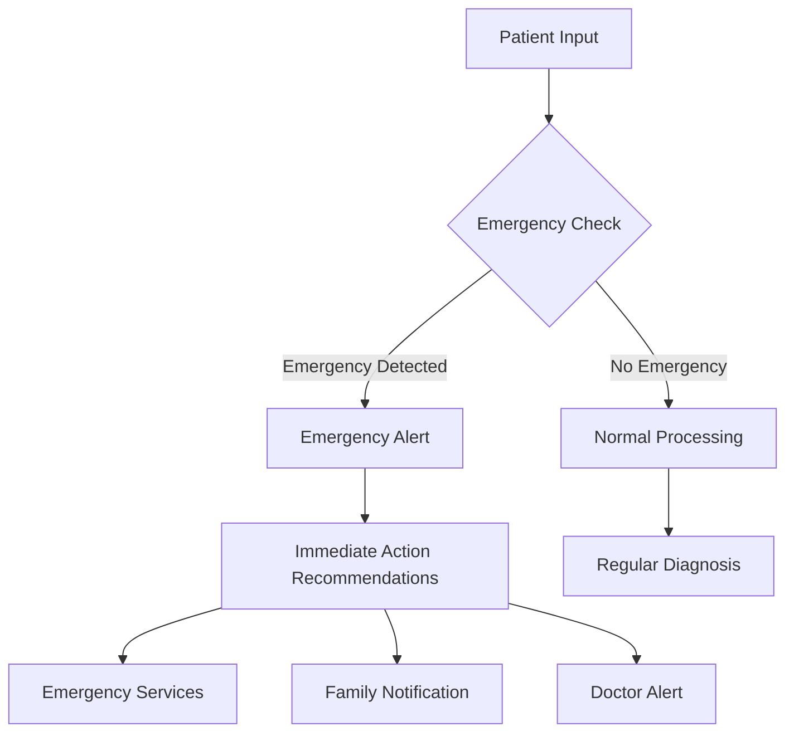
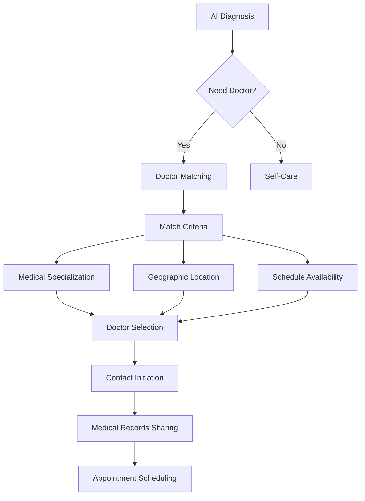
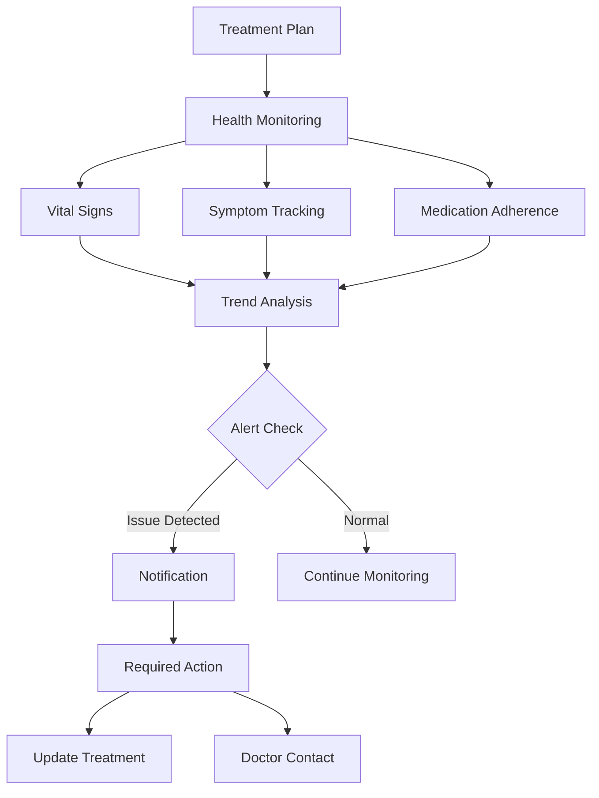
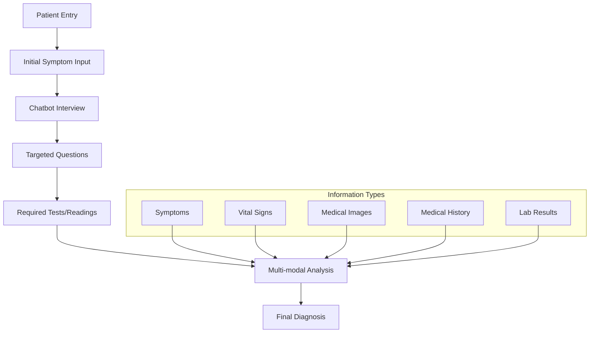

# MedFlow System Architecture Diagrams

## 1. High-Level System Architecture

## 2. Patient Journey Flow

## 3. AI Processing Pipeline

## 4. Emergency Response Flow

## 5. Doctor Referral Process

## 6. Health Monitoring System

## 7. Information Gathering Flow

These diagrams provide a visual representation of the MedFlow system's architecture and workflows. Each diagram focuses on a specific aspect of the system, making it easier to understand the different components and their interactions.

The diagrams show:
1. The overall system architecture
2. The patient journey through the system
3. The AI processing pipeline
4. Emergency response procedures
5. Doctor referral process
6. Health monitoring system
7. Information gathering flow

Would you like me to explain any specific diagram in more detail or create additional diagrams for other aspects of the system?

Input Threads:
1. Primary Symptom: Chest pain
2. Location: Left side
3. Duration: 30 minutes
4. Associated Symptoms: Shortness of breath, sweating
5. Vital Signs: Elevated heart rate, blood pressure
6. Medical History: Family history of heart disease

Connection:
- Chest pain + Shortness of breath = Possible cardiac issue
- Elevated vitals support cardiac concern
- Family history increases risk
- System recommends ECG and chest X-ray
